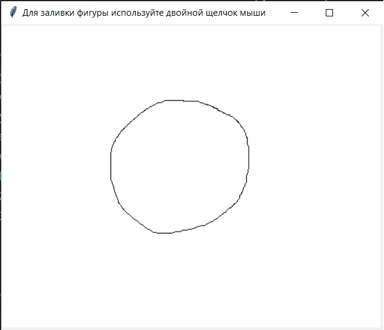
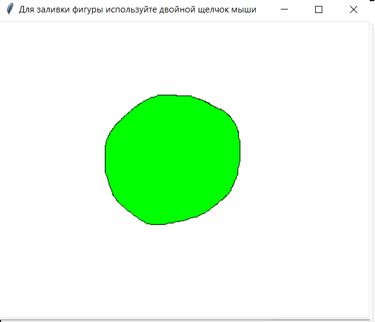
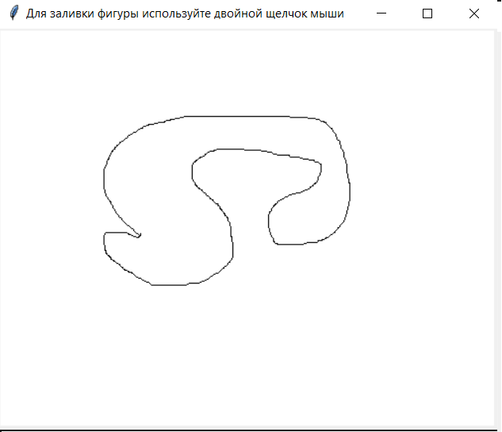
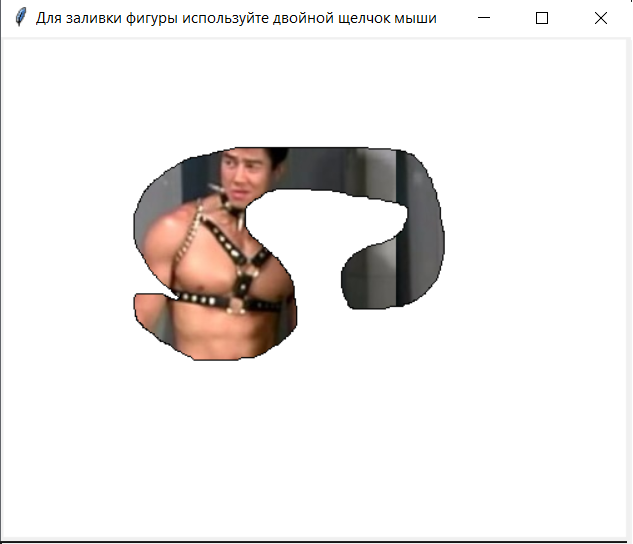
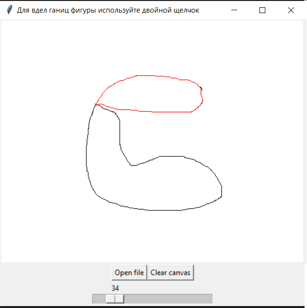
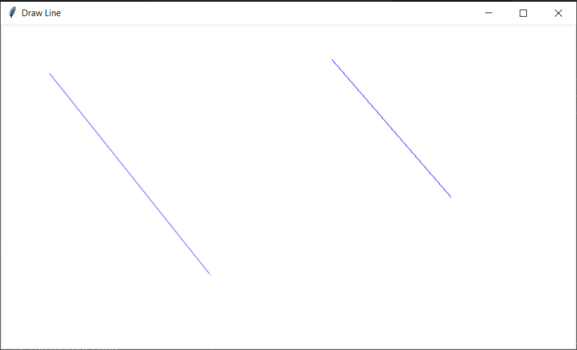
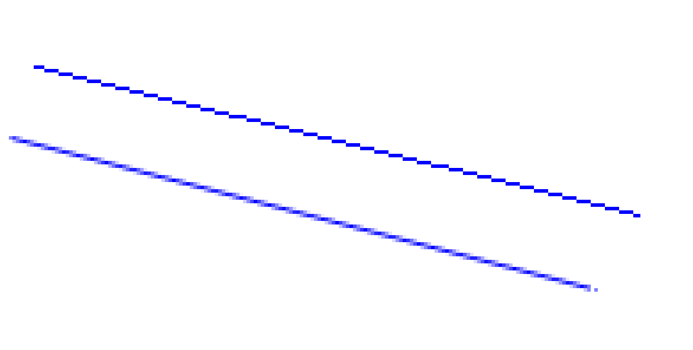
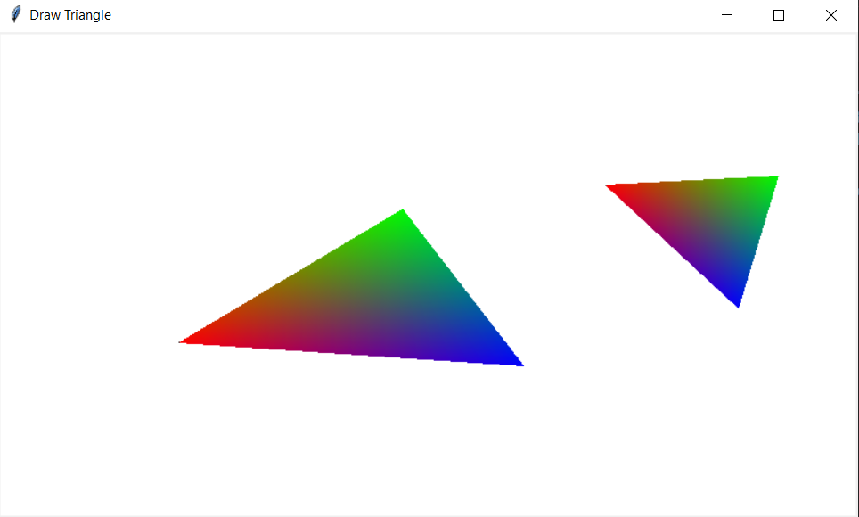

# Лабораторная 3
**Растровые алгоритмы**
**Задание 1**
1а) Рекурсивный алгоритм заливки на основе серий пикселов (линий) заданным цветом.

Пример заливки одним цветом.

1б) Рекурсивный алгоритм заливки на основе серий пикселов (линий)  рисунком из графического файла. Файл можно загрузить встроенными средствами и затем считывать точки изображения для использования в заливке. Рассмотреть случаи когда файл небольшого размера и заливается циклически и когда большой. Масштабировать не нужно.  Область рисуется мышкой. Область произвольной формы. Внутри могут быть отверстия. Точка, с которой начинается заливка, задается щелчком мыши.

Пример заливки картинкой.

1в) Выделение границы связной области. На вход подается изображение. Граница связной области задается одним цветом. Имея начальную точку границы организовать ее обход, занося точки в список в порядке обхода. Начальную точку границы можно получать любым способом. Для контроля полученную границу прорисовать поверх исходного изображения.

Пример выделений границ.

**Задание 2**. Реализовать рисование отрезка: целочисленным алгоритмом Брезенхема  и алгоритмом ВУ
(линии Брезенхема рисуются на левую кнопук мыши;  Ву на правую)

Пример работы программы

Пример линий в близи: вверху линия Брезенхема, внизу Ву

**Задание 3.** Выполнить градиентное окрашивание произвольного треугольника, у которого все три вершины разного цвета, используя алгоритм растеризации треугольника.

Примеры работы программы

**Все задания выполнены с помощью Tkinter**

