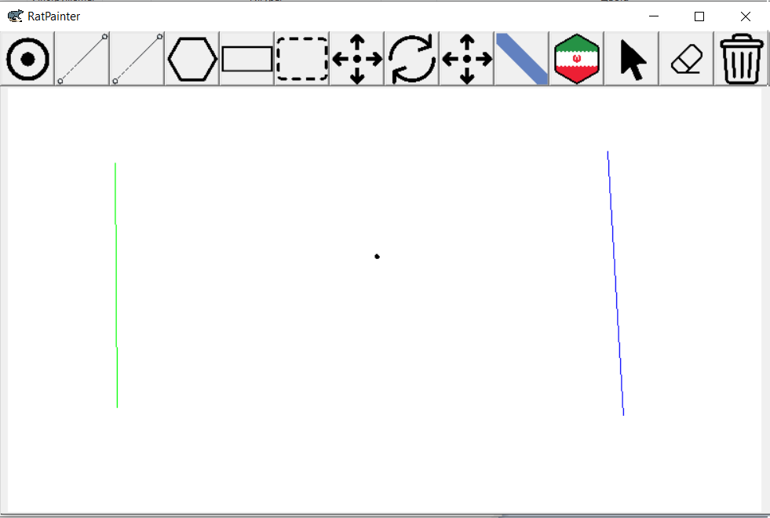

# Лабораторная работа 4
**Аффинные преобразования на плоскости и вспомогательные алгоритмы**
Программа должна содержать следующие возможности:

* Задать текущий примитив: точка, ребро (отрезок), полигон (мин требование -- квадрат). Они рисуются мышкой.
* Очистить сцену.
* Применение аффинных преобразований к полигону: смещение на dx, dy; поворот вокруг произвольной точки (точка задается пользователем мышкой) и/или вокруг своего центра; масштабирование относительно произвольной точки (точка задается пользователем мышкой) и/или относительно своего центра. Все преобразования должны быть реализованы матрицами!
* Поворот ребра на 90 градусов вокруг своего центра.
* Поиск точки пересечения двух ребер (добавление второго ребра мышкой, динамически).

Программа должна позволять выполнить следующие проверки:

* Принадлежит ли точка выпуклому многоугольнику (задание точки мышкой).
* Принадлежит ли точка невыпуклому многоугольнику (задание точки мышкой).
* Классифицировать положение точки относительно ребра (задание точки мышкой).

**Внешний вид интерфейса**

---
**Рисование Примитивов**

Иконки

Рисование точек

Рисование линий

Рисование полигонов
---
**Отслеживание пересечений**

---
**Выделение фигур**

Иконки

---
**Аффиные преобразования**

Иконки

Движение выделенной фигуры мышкой

Поворот выделенной фигуры колесом мыши

Скалирование выделенной фигуры относитель но точки.
(Фигура меняет размер в таком же отношении как и созданный отрезк)
---
**Классификация положения точки относительно ребра**

Иконки

Рёбра от которых точки находится справа подсвечиваются синим, а от которых она находится слева зелёным
---
**Проверка находится ли точка внутри или снаружи полигона**

Иконки

Полигон внутри которого находится точки подсвечивается красным а остальные подсвечиваются синим

*Реализованы 2 различных алгоритма проверки 1 работает только для выпуклых полигонов второй для любых*

**Также были реализованы кнопки для полной отчистки экрана и для удаления выделеных фигур**

Иконки