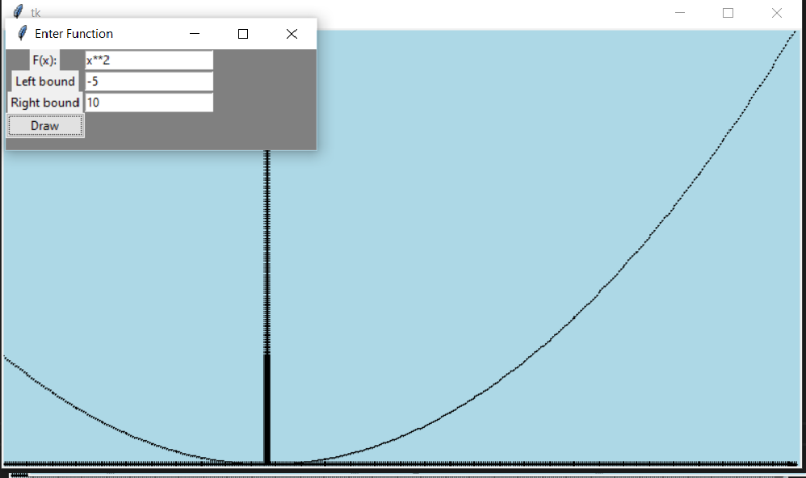
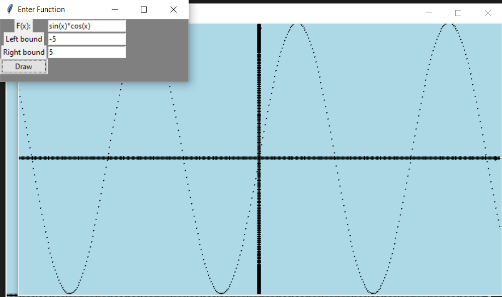
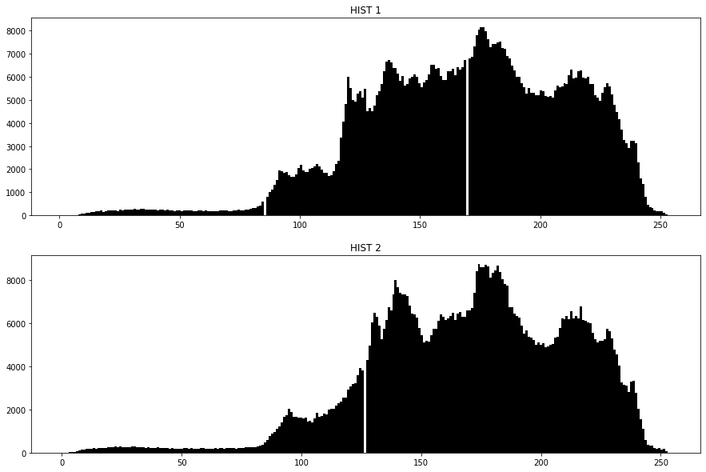
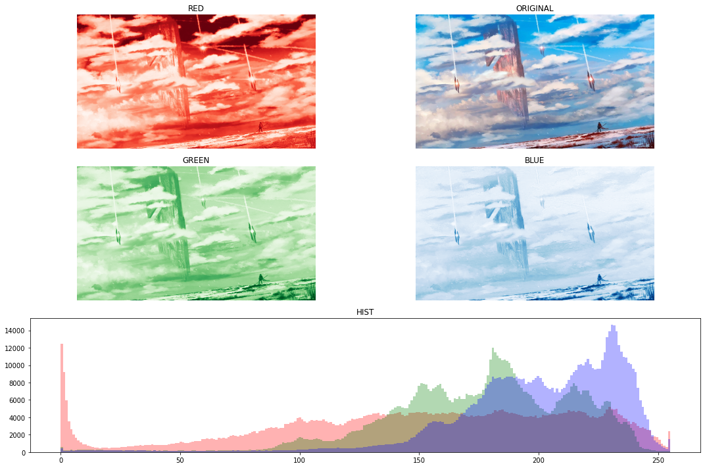
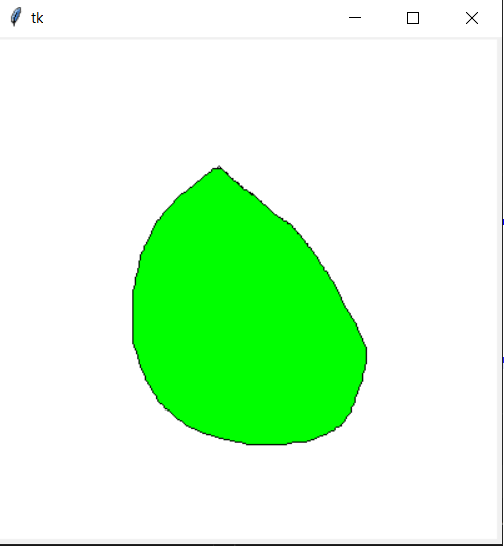
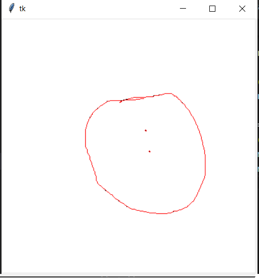
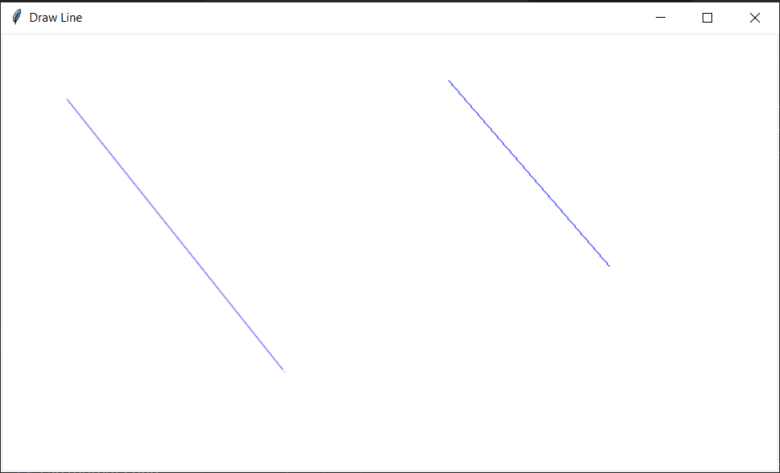
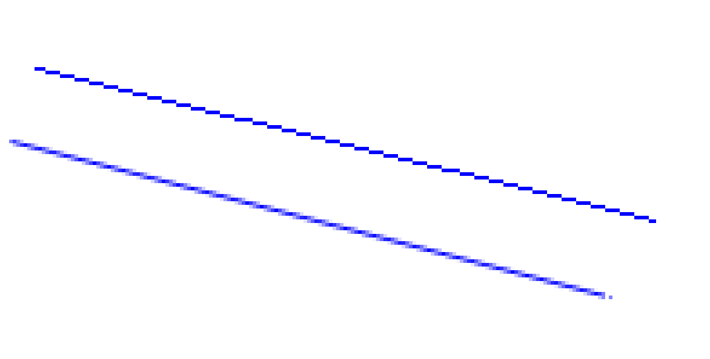
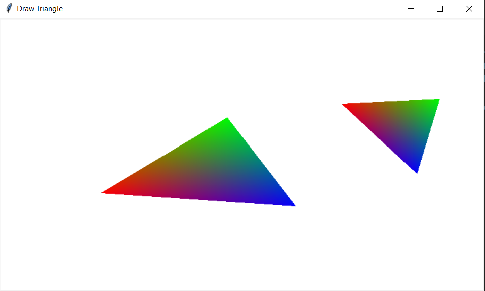

# ComputerGraphic2022
Репа для хранения  заданий по университетскому курсу Компьютерной графики
---
# Содержание:
В данном репозитории хранятся сделанные лабы по компьютерной графике каждая в своей папке
# Лабораторная 1
**Построение графика функции.** 
Задаются: диапазон значений, функция, необходимо построить график с возможностью масштабирования – в максимальных и минимальных точках график касается верхних и нижних границ графического окна. Обязательный тест – sin(x) и x^2.
Необходимо предусмотреть выбор функций из некоторого списка. В функцию построения графика функцию передавать как параметр.
Не использовать стандартные функции построения графиков.

**Данная лабораторная выполнена на языке Python с использование библиотеки Tkinter**

Примеры работы программы

# Лабораторная 2
**Цветовые пространства. Преобразование цветовых пространств.** 
1) Преобразовать изображение из RGB в оттенки серого. Реализовать два варианта формулы с учетом разных вкладов R, G и B в интенсивность (см презентацию). Затем найти разность полученных полутоновых изображений. Построить гистограммы интенсивности после одного и второго преобразования.

2) Выделить из полноцветного изображения каждый из каналов R, G, B  и вывести результат. Построить гистограмму по цветам (3 штуки).

3)Преобразовать изображение из RGB в HSV. Добавить возможность изменять значения оттенка, насыщенности и яркости. Результат сохранять в файл, предварительно преобразовав обратно.

**Задания 1-2  сделаны с использование библиотеки matplotlib и numpy, интерфейс к заданию 3 выполнен с помощью Tkinter**

Примеры работы программы

# Лабораторная 3
**Растровые алгоритмы**

1а) Рекурсивный алгоритм заливки на основе серий пикселов (линий)  заданным цветом.

1б) Рекурсивный алгоритм заливки на основе серий пикселов (линий)  рисунком из графического файла. Файл можно загрузить встроенными средствами и затем считывать точки изображения для использования в заливке. Рассмотреть случаи когда файл небольшого размера и заливается циклически и когда большой. Масштабировать не нужно.  Область рисуется мышкой. Область произвольной формы. Внутри могут быть отверстия. Точка, с которой начинается заливка, задается щелчком мыши.

1в) Выделение границы связной области. На вход подается изображение. Граница связной области задается одним цветом. Имея начальную точку границы организовать ее обход, занося точки в список в порядке обхода. Начальную точку границы можно получать любым способом. Для контроля полученную границу прорисовать поверх исходного изображения.

Примеры работы программы

Задание 2. Реализовать рисование отрезка: целочисленным алгоритмом Брезенхема  и алгоритмом ВУ

Примеры работы программы

Задание 3. Выполнить градиентное окрашивание произвольного треугольника, у которого все три вершины разного цвета, используя алгоритм растеризации треугольника.

**Все задания выполнены с помощью Tkinter**
*Пока сделанно только задание 3 бывают артифакты закраски*

Примеры работы программы
