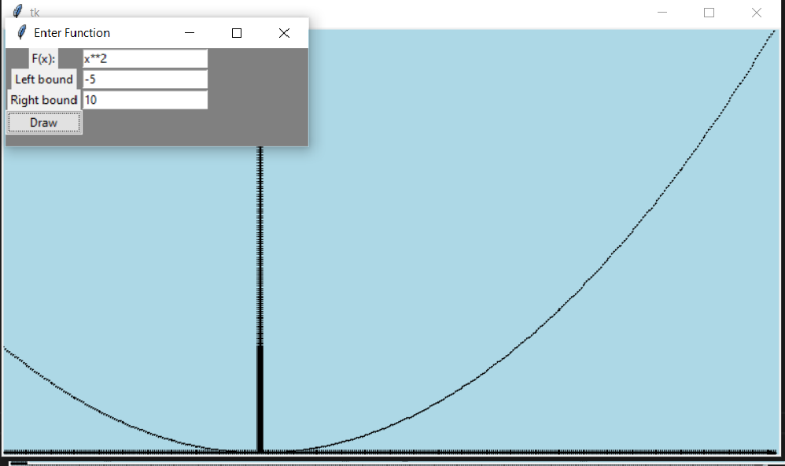
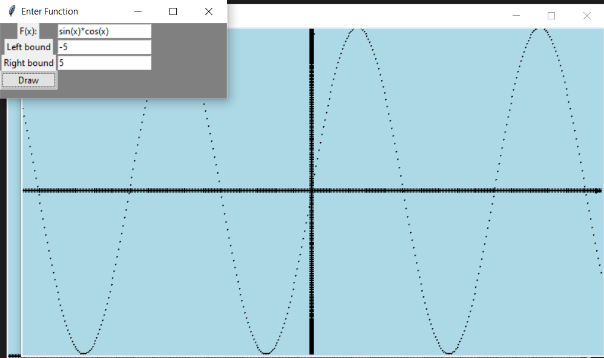
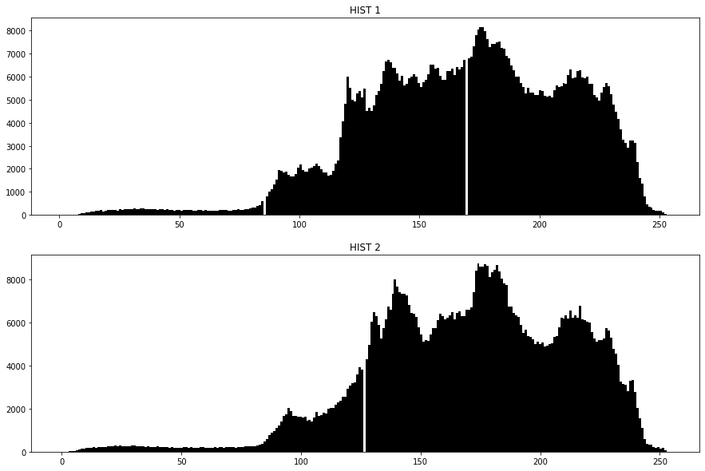

# ComputerGraphic2022
Репа для хранения  заданий по университетскому курсу Компьютерной графики
---
# Содержание:
В данном репозитории хранятся сделанные лабы по компьютерной графике каждая в своей папке
# Лабораторная 1
**Построение графика функции.** 
Задаются: диапазон значений, функция, необходимо построить график с возможностью масштабирования – в максимальных и минимальных точках график касается верхних и нижних границ графического окна. Обязательный тест – sin(x) и x^2.
Необходимо предусмотреть выбор функций из некоторого списка. В функцию построения графика функцию передавать как параметр.
Не использовать стандартные функции построения графиков.

**Данная лабораторная выполнена на языке Python с использование библиотеки Tkinter**

Примеры работы программы

# Лабораторная 2
**Цветовые пространства. Преобразование цветовых пространств.** 
1) Преобразовать изображение из RGB в оттенки серого. Реализовать два варианта формулы с учетом разных вкладов R, G и B в интенсивность (см презентацию). Затем найти разность полученных полутоновых изображений. Построить гистограммы интенсивности после одного и второго преобразования.

2) Выделить из полноцветного изображения каждый из каналов R, G, B  и вывести результат. Построить гистограмму по цветам (3 штуки).

3)Преобразовать изображение из RGB в HSV. Добавить возможность изменять значения оттенка, насыщенности и яркости. Результат сохранять в файл, предварительно преобразовав обратно.

**Задания 1-2  сделаны с использование библиотеки matplotlib и numpy, интерфейс к заданию 3 выполнен с помощью Tkinter**

Примеры работы программы

# Лабораторная 3
**Растровые алгоритмы**

[Lab3 README](Lab3/README.md)

# Лабораторная работа 4
**Аффинные преобразования на плоскости и вспомогательные алгоритмы**

[Lab4 README](Lab4/README.md)

# Лабораторная работа №5
**L-системы. Алгоритм midpoint displacement. Кривые Безье**

[Lab5 README](Lab5/README.md)
